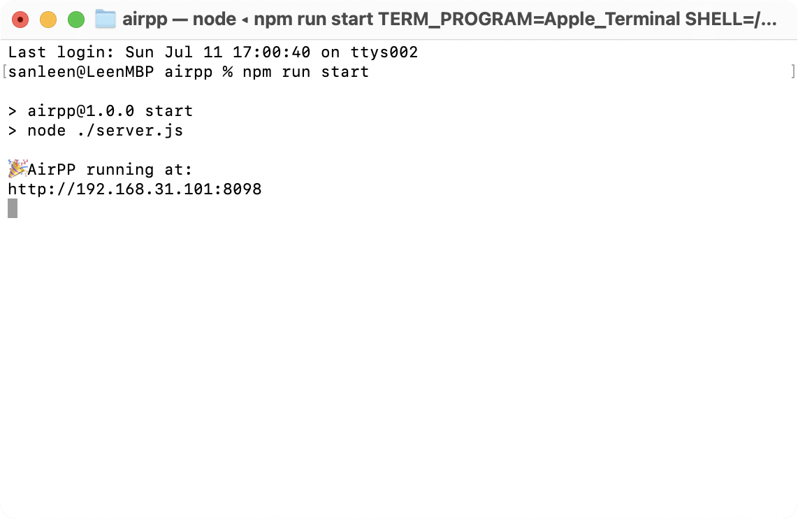
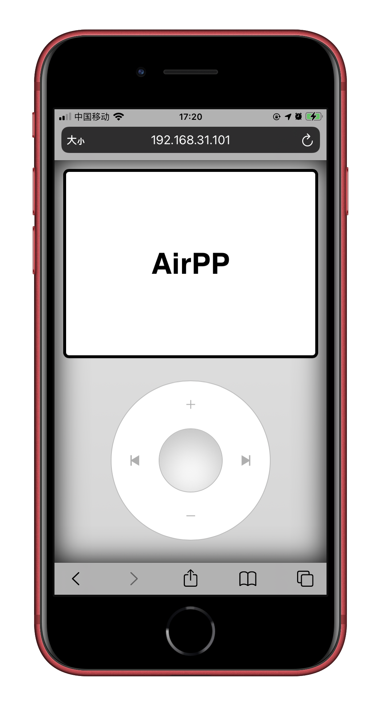

# AirPP
> Control the media playback of the PC/MAC under the local area network on the web.





## Environments

|  name   | version  |
|  ----  | ----  |
| [node](https://nodejs.org/zh-cn/download)  | v12.18.2+ |
| [xcode](https://apps.apple.com/cn/app/xcode/id497799835) `MAC dev only`  | v12.5.1+ |

## Steps

### build darwin lib `first time only for darwin`
```shell
npm run build_darwin_lib
```

### run server
```shell
npm run start
```

### open `http://x.x.x.x:8098` in browser

## References

* core control code : [lihaoyun6](https://github.com/lihaoyun6)
* user interface : [iPod.js](https://tannerv.com/ipod/)
* icons : [ionicons](https://github.com/ionic-team/ionicons)
* screenshot with device : [Picsew](https://apps.apple.com/cn/app/id1208145167)

## License

[MIT license](http://opensource.org/licenses/MIT)